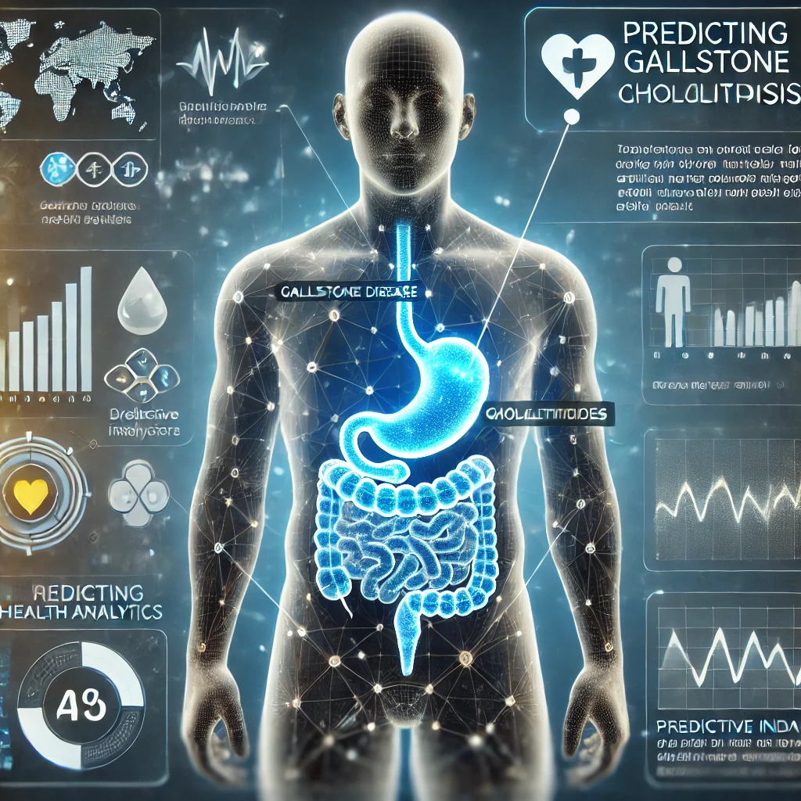

# Cholelithiasis Health Status Prediction Dashboard



## Overview
A machine learning-based dashboard for predicting health status in **cholelithiasis (gallstone disease) patients**. This project includes data preprocessing, model training, and evaluation using various classification algorithms to assess patient risk and health outcomes.

## Features
- **Data Analysis**: Explore and preprocess cholelithiasis-related datasets.
- **Model Training**: Train various machine learning models to predict health statuses.
- **Evaluation**: Assess model performance using appropriate metrics.
- **Interactive Dashboard**: Visualize predictions and insights for better medical decision-making.

## Installation
1. Clone the repository:
   ```bash
   git clone https://github.com/usman9-ai/Cholelithasis-Dashboard.git
   ```
2. Navigate to the project folder:
   ```bash
   cd Cholelithasis-Dashboard
   ```
3. Install dependencies:
   ```bash
   pip install -r requirements.txt
   ```
4. Follow the `installation.ipynb` notebook for environment setup.

## Usage
1. Load and preprocess data using `health_status_classification.ipynb`.
2. Train models using `training.ipynb`.
3. Evaluate performance and visualize insights.
4. Run the dashboard from the `Dashboard/` directory.


## License
This project is licensed under the [MIT License](LICENSE).

